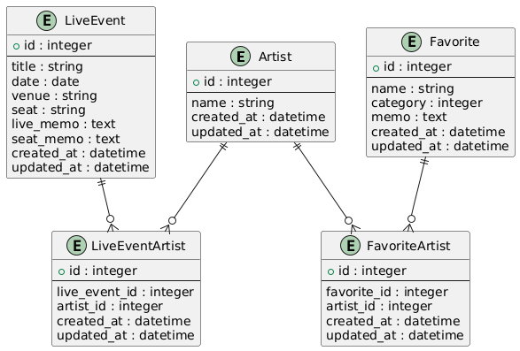
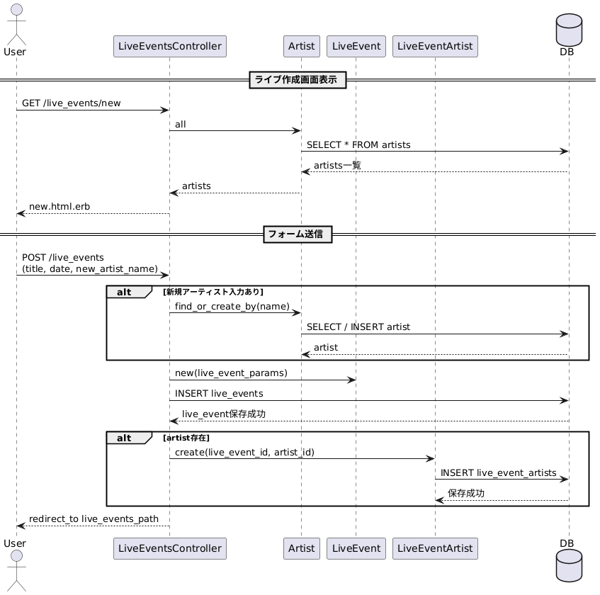
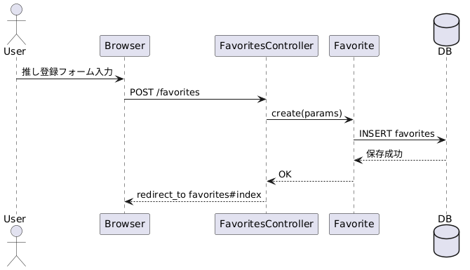
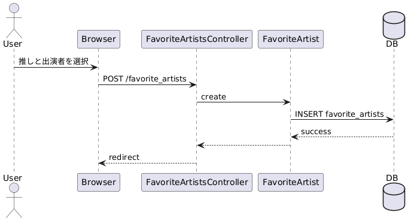

# Oshilog

## 概要
ライブの記録と推し管理を行うWebアプリです。

## 使用技術
- Ruby 3.3.0
- Rails 8.0.3
- PostgreSQL
- Tailwind CSS

## ER図


## シーケンス図
- ライブ作成の流れ


- 推し登録の流れ


- 推しと出演者の紐づけ


## 機能一覧
- ライブ登録（出演者複数選択可）
- 推し登録（カテゴリー・メモ付き）
- 出演者でのライブ絞り込み

## 環境構築
```bash
git clone https://github.com/omeletterice-vs-hamburgersteak/live_log.git
cd live_log
bundle install
rails db:create db:migrate
bin/dev
```